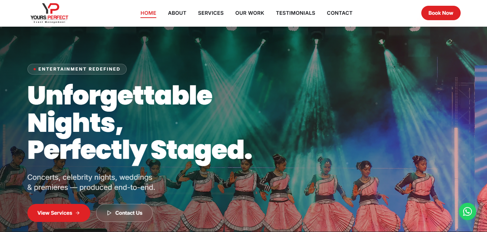

# Your Perfect Eventz Management — Official Website

A modern, responsive event management website developed for **Your Perfect Eventz Management, Salem**, featuring a React frontend, PHP backend, MySQL database, Cloudinary media management, custom administration panel, and PHP-based email integration.

🌐 **Live Website:** https://yourperfecteventz.com/

---

## 📸 Website Preview

### Home Page



*Official website of Your Perfect Eventz Management, Salem.*

---

# 👨‍💻 Developer

**Ruban M**

Frontend Developer focused on **React, modern web development, backend API integration, cloud services, and AI-powered business automation**.

🌐 Portfolio: https://ruban.persyntra.com/

---

## 📌 About the Project

**Your Perfect Eventz Management** is a professional event management company based in Salem, providing event planning and management services for different types of occasions.

The website was developed as a **full-stack web application** to establish the company's digital presence, showcase its event services and previous work, and provide a convenient enquiry and quotation system for potential clients.

The application consists of a public-facing React website and a custom-built administration panel for managing website content and enquiries.

The project combines:

- Modern React frontend development
- PHP REST API backend
- MySQL database
- Cloudinary cloud media management
- Custom React Admin Panel
- PHP email integration
- Contact and quotation enquiry management
- Responsive UI/UX
- Production deployment

---

## 🎯 Project Objectives

The main objectives of the project were to:

- Create a professional online presence for the event management company
- Showcase event planning and management services
- Display previous event work through an image gallery
- Provide an enquiry and quotation system
- Allow administrators to manage website content
- Store contact and enquiry information in MySQL
- Manage a growing collection of event images using Cloudinary
- Reduce server storage requirements for media files
- Provide email notifications for customer enquiries
- Build a scalable structure for future website updates

---

## ✨ Key Features

### 🌐 Public Website

- Modern responsive landing page
- Professional hero section
- About the company section
- Event management services
- Event portfolio / gallery
- Testimonials
- Contact section
- Get Quote functionality
- Event date selection
- Contact enquiry form
- Form validation
- Responsive navigation
- Mobile, tablet, and desktop support
- SEO-friendly structure
- Interactive UI elements

### 🖼️ Media & Gallery Management

The website uses **Cloudinary** for managing event images and media.

Instead of storing large media files directly on the hosting server, the application uses Cloudinary for:

- Image uploads
- Cloud-based media storage
- Image delivery
- Media URL management
- Gallery management
- Reduced hosting storage usage

This allows the website to handle a growing collection of event images without relying entirely on local server storage.

### 🔐 Admin Panel

A custom React-based administration panel was developed to allow the client to manage website content.

The admin panel provides management functionality for areas such as:

- Services
- Gallery / media
- Testimonials
- Contact enquiries
- Website content
- Event information

The admin interface communicates with the PHP backend through REST APIs.

### 📩 Contact & Quote System

Visitors can submit enquiries through the website by providing information such as:

- Name
- Email
- Phone number
- Event date
- Event requirements
- Message

The submitted information is processed through the PHP backend and stored in the MySQL database.

### 📧 PHP Mail Integration

The backend includes PHP-based email functionality for processing website enquiries.

The system can send enquiry-related email notifications to the configured business email address.

This allows the company to receive customer enquiries directly through email without manually checking the database.

---

# 🏗 Application Architecture

The application follows a full-stack architecture where the React frontend communicates with a PHP REST API backend.

```text
┌──────────────────────────────────┐
│       React Frontend             │
│                                  │
│ Home / Services / Gallery        │
│ Contact / Get Quote / Admin      │
└───────────────┬──────────────────┘
                │
                │ REST API
                ▼
┌──────────────────────────────────┐
│          PHP Backend             │
│                                  │
│ API / CRUD / Validation          │
│ Email / Cloudinary Integration   │
└───────────────┬──────────────────┘
                │
        ┌───────┴────────┐
        ▼                ▼
┌──────────────┐   ┌───────────────┐
│    MySQL     │   │   Cloudinary  │
│              │   │               │
│ Enquiries    │   │ Event Images  │
│ Services     │   │ Gallery Media │
│ Testimonials │   │ Media URLs    │
└──────────────┘   └───────────────┘
        │
        ▼
┌──────────────────────────────┐
│       PHP Mail System        │
│                              │
│ Enquiry Email Notifications  │
└──────────────────────────────┘
```

---

# 🖼️ Cloudinary Media Architecture

Managing a large number of event images was an important requirement of the project.

Instead of storing all uploaded images directly on the hosting server, Cloudinary is used as the media storage and delivery layer.

```text
Admin Panel
     │
     ▼
React Upload Interface
     │
     ▼
PHP Backend
     │
     ▼
Cloudinary
     │
     ├──► Upload Image
     ├──► Store Media
     └──► Return Secure URL
              │
              ▼
           MySQL
              │
              └──► Store Media Reference
```

The database stores relevant media information while Cloudinary handles the actual image storage and delivery.

### Benefits

- Reduces server storage usage
- Supports large media collections
- Centralized media management
- Reliable image delivery
- Easier gallery administration
- Scalable media architecture

---

# 🔐 Admin Panel

A custom administration panel was developed to allow the client to manage website information without modifying source code.

### Admin Features

- Dashboard
- Service management
- Add services
- Edit services
- Delete services
- Gallery/media management
- Upload event images
- Delete media
- Testimonial management
- Enquiry/lead management
- Content management

The admin panel communicates with the backend through dedicated PHP API endpoints.

### Admin Architecture

```text
Admin User
    │
    ▼
React Admin Panel
    │
    │ REST API
    ▼
PHP Backend
    │
    ├──────────────► MySQL
    │
    └──────────────► Cloudinary
```

---

# 🛠 Technology Stack

## Frontend

- React
- JavaScript / TypeScript
- Vite
- HTML5
- CSS3
- Responsive Web Design
- REST API Integration
- Component-Based Architecture

## Backend

- PHP
- REST APIs
- CRUD Operations
- Form Processing
- Server-Side Validation
- JSON API Communication
- PHP Mail Integration
- Cloudinary API Integration

## Database

- MySQL
- SQL
- Relational Database Design
- CRUD Operations
- Data Validation

## Media Management

- Cloudinary
- Cloud Media Storage
- Image Upload API
- Image URL Management

## Development Tools

- Git
- GitHub
- VS Code
- Postman
- XAMPP
- npm
- Vite

## Deployment

- Hostinger
- Production Web Hosting
- Domain & DNS Configuration
- SSL / HTTPS

---

# 📁 Project Structure

A simplified structure of the project:

```text
your-perfect-eventz/
│
├── frontend/
│   ├── src/
│   │   ├── components/
│   │   ├── pages/
│   │   ├── admin/
│   │   ├── services/
│   │   ├── assets/
│   │   ├── hooks/
│   │   ├── App.jsx
│   │   └── main.jsx
│   │
│   ├── public/
│   ├── package.json
│   ├── vite.config.js
│   └── ...
│
├── backend/
│   ├── admin/
│   ├── api/
│   │   ├── contact.php
│   │   ├── get_services.php
│   │   ├── add_service.php
│   │   ├── update_service.php
│   │   ├── delete_service.php
│   │   └── ...
│   ├── config/
│   ├── vendor/
│   └── ...
│
├── database/
│   ├── schema.sql
│   └── seed.sql
│
├── screenshots/
│   ├── home.png
│   ├── services.png
│   ├── gallery.png
│   ├── contact.png
│   └── admin-dashboard.png
│
├── .gitignore
├── .env.example
└── README.md
```

> The exact folder structure may vary depending on the deployment and development environment.

---

# 🚀 Getting Started

## Prerequisites

Make sure the following are installed:

- Node.js
- npm
- PHP
- MySQL
- Apache / XAMPP
- Git
- Composer (if required by backend dependencies)

## Clone Repository

```bash
git clone <repository-url>
cd your-perfect-eventz
```

## Frontend Setup

Navigate to the frontend directory:

```bash
cd frontend
```

Install dependencies:

```bash
npm install
```

Start the development server:

```bash
npm run dev
```

---

# 🔧 Environment Configuration

Create environment configuration files based on the provided examples.

Frontend example:

```env
VITE_API_BASE_URL=
```

Backend configuration may include:

```text
Database Host
Database Username
Database Password
Database Name

Cloudinary Cloud Name
Cloudinary API Key
Cloudinary API Secret

Mail Configuration
SMTP Host
SMTP Username
SMTP Password
```

# 📱 Responsive Design

The website is designed to provide a consistent experience across:

- Mobile devices
- Tablets
- Laptops
- Desktop screens

The responsive implementation adapts:

- Navigation
- Typography
- Layout
- Cards
- Forms
- Gallery
- Buttons
- Spacing
- Administrative interfaces

according to the available screen size.

---

# ⚡ Performance & Optimization

The frontend follows modern development practices including:

- Component-based architecture
- Optimized assets
- Production builds using Vite
- Efficient API communication
- Responsive layouts
- Cloud-based media delivery through Cloudinary
- Lazy loading where appropriate

Cloudinary also reduces the requirement to serve large media files directly from the application server.

---

# 🔒 Security Considerations

The application follows basic security practices including:

- Frontend form validation
- Server-side validation
- API request validation
- Environment-based configuration
- Protected database credentials
- Sanitized GitHub repository configuration
- Separation of frontend and backend responsibilities
- Secure media management through Cloudinary
- Protection of email credentials

Production credentials and client-specific information are intentionally excluded from the public repository.

---

# 🎯 What This Project Demonstrates

This project demonstrates practical experience with:

### Frontend Development

- React development
- Component-based architecture
- Responsive UI development
- Modern web design
- Form handling
- API integration
- Admin dashboard development

### Backend Development

- PHP backend development
- REST API development
- CRUD operations
- Server-side validation
- Form processing
- JSON API responses
- PHP email integration

### Database

- MySQL
- SQL queries
- Relational data management
- CRUD operations
- Database-backed application development

### Cloud & Media

- Cloudinary integration
- Cloud media storage
- Image upload workflows
- Media URL management
- Third-party API integration

### Full-Stack Engineering

- Frontend/backend integration
- API-driven architecture
- Database integration
- Production deployment
- Environment configuration
- Client-focused development

---

## 📄 License

This project was developed for **Your Perfect Eventz Management, Salem**.

The source code, design, content, media assets, and client-specific implementation details may be proprietary and are not intended for unauthorized commercial reuse.

---

**Built with React, PHP, MySQL & Cloudinary.**
